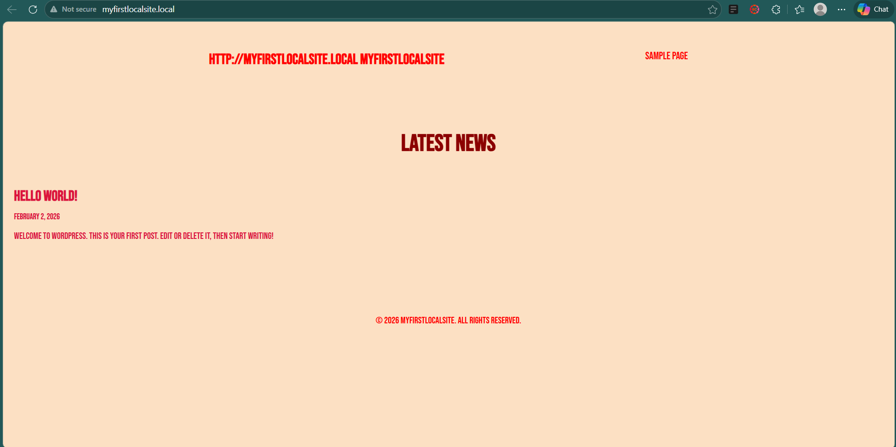

## Assignment 2: Custom WordPress Theme | Eyanla Garcia | 3/8/26

### WordPress Theme Structure & Architecture

eg-metro-theme is a theme designed for The Metro Report to showcase news articles and images in a editorial style layout. this theme includes all core files needed including "footer.php", "header.php", "function.php", "index.php", "page.php", "single.php", and the file for the stylesheet

### The Loop & Template Tags

the loop is used throughout tje theme to display posts dynamically including the title, excerpt,featured image, date, author, and content.

### final product

